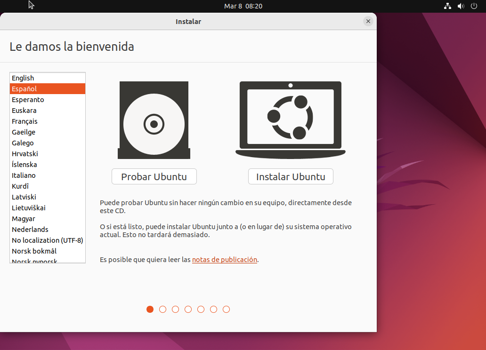
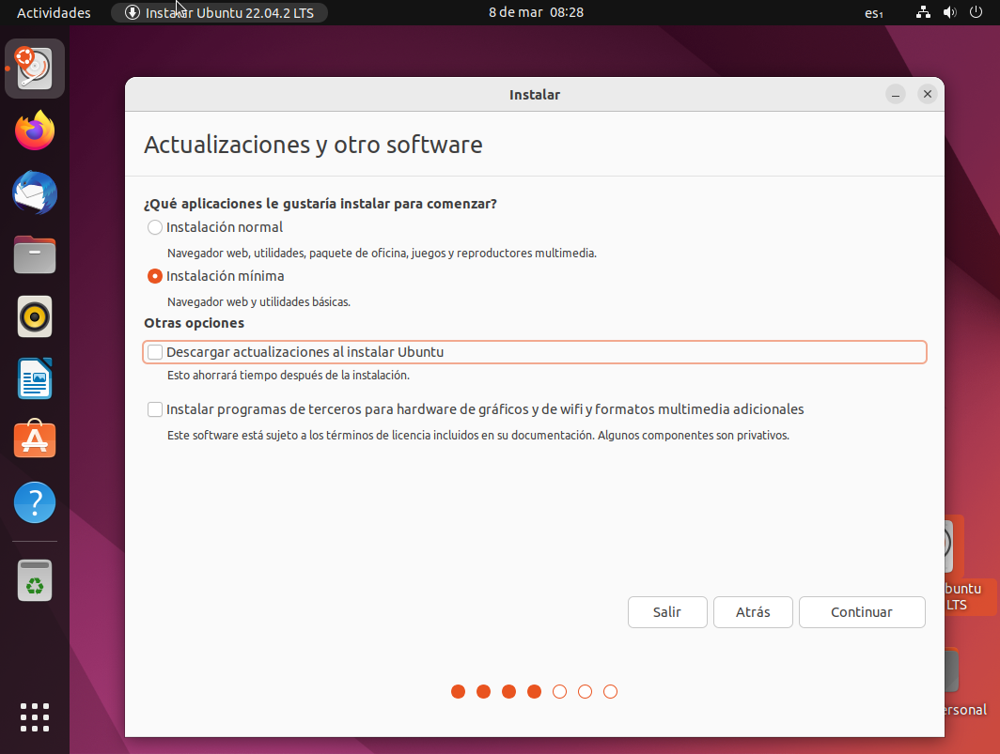

# Intalacion Ubuntu
## ¿Que es Ubuntu?
  es una distribución Linux basada en Debian GNU/Linux, que incluye principalmente software libre y de código abierto. Puede utilizarse en ordenadores y servidores. Está orientado al usuario promedio, con un fuerte enfoque en la facilidad de uso y en mejorar la experiencia del usuario. Está compuesto de múltiple software normalmente distribuido bajo una licencia libre o de código abierto. Estadísticas web sugieren que la cuota de mercado de Ubuntu dentro de las distribuciones Linux es, aproximadamente, del 52 % y con una tendencia a aumentar como servidor web.5
  # Procesos de instalacion
  
  - Descargaremos VirtualBox para el sistema operativo de nuestro ordenador.
  ## Configuración de Virtual Box
  
  - Arrancamos VirtualBox y hacemos click en "Nueva"
   
  
  - Escribimos el nombre de la máquina virtual, en nuestro caso "ubuntu"
  
  
  - Debemos indicarle la memoria principal (RAM) que tendrá nuestra máquina virtual. En este caso Ubuntu recomienda escoger un tamaño mínimo de 2048MB 
   
   
  - Creamos un disco duro virtual, que se creara como un archivo, y que tendrá un tamaño de 25 GB
   
   
  - Elegimos del tipo de disco duro virtual del tipo VDI
   
  - Le indicamos que el fichero del disco duro virtual crezca dinámicamente, a medida que necesitemos más espacio
  - -
  - 
  - Configuramos el tamaño del disco duro virtuala 25GB, ya que es el tamaño recomendado en la instalación de Ubuntu 22.04
   -
   
  - Ya tenemos creada la máquina virtual, solo nos falta introducir el disco virtual del sistema operativo
  - Nos descargamos previamente el archivo ISO de la sitribución LInux que queremos. En nuestro caso hemos elegido la distribución en su versión 22.04
  - El siguiente paso es "montar" la ISO en el lector virtual de la máquina virtual. Para ello hacemos click en "Configurar y posteriormente vamos a la sección "almacenamiento"
  - Una vez abierto el "almacenamiento" pulsaremos donde pone vacío, justo debajo de "Controlador: IDE", pulsaremos en el disco azul de la derecha del todo y haremos click en "Seleccionar un archivo de disco". Buscaremos el archivo de Ubuntu que nos hemos descargado anteriormente.
  - Por último le damos a "Iniciar" en la máquina virtual 
  
  
  ## Instalación Ubuntu
  - Al darle a "Iniciar", obtendremos esta pantalla: 
 
  Pulsaremos en probarlo y más adelante lo instalaremos. Y elegiremos uno de los idiomas.
  
  - Elegimos el idioma y hacemos click en "Instalar Ubuntu"
  
  
  
  
  - Elegimos la distribución del teclado
   
   
  - Elegimos el tipo de instalación y si actualizaremos o instalaremos sofware de terceros
   
   
  - Elegimos borrar todo el disco y que se instale Ubuntu como único sistema operativo
   
   
   
# Referencias
  "UBUNTU". Wikipedia.Disponile en: https://es.wikipedia.org/wiki/Ubuntu (Accedido: 6 de marzo, 2023)
