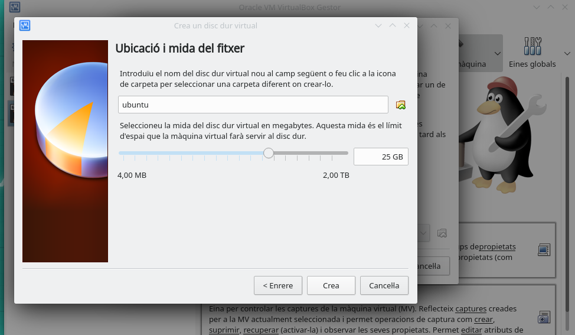
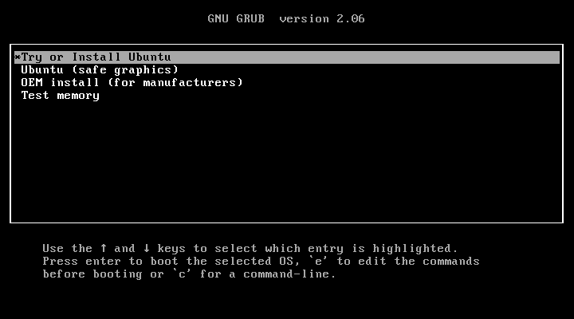
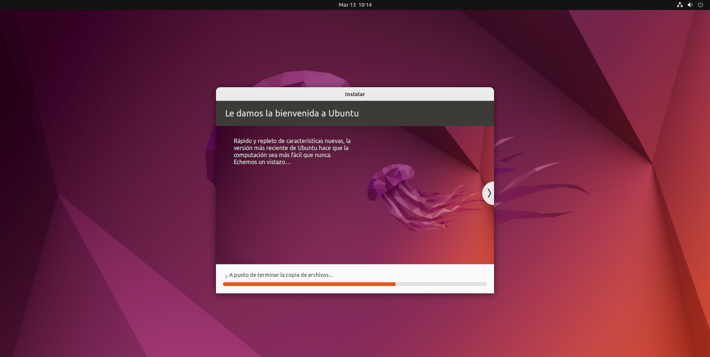

# Intalacion Ubuntu
## ¿Que es Ubuntu?
  es una distribución Linux basada en Debian GNU/Linux, que incluye principalmente software libre y de código abierto. Puede utilizarse en ordenadores y servidores. Está orientado al usuario promedio, con un fuerte enfoque en la facilidad de uso y en mejorar la experiencia del usuario. Está compuesto de múltiple software normalmente distribuido bajo una licencia libre o de código abierto. Estadísticas web sugieren que la cuota de mercado de Ubuntu dentro de las distribuciones Linux es, aproximadamente, del 52 % y con una tendencia a aumentar como servidor web.5
  # Procesos de instalacion
  
  - Descargaremos VirtualBox para el sistema operativo de nuestro ordenador.
  ## Configuración de Virtual Box
  
  - Arrancamos VirtualBox y hacemos click en "Nueva"
  
  - Escribimos el nombre de la máquina virtual, en nuestro caso "ubuntu"
  
  
  
  - Debemos indicarle la memoria principal (RAM) que tendrá nuestra máquina virtual. En este caso Ubuntu recomienda escoger un tamaño mínimo de 2048MB 
  
  
   
  - Creamos un disco duro virtual, que se creara como un archivo, y que tendrá un tamaño de 25 GB
   
   
   
  - Elegimos del tipo de disco duro virtual del tipo VDI
   
   
   
  - Le indicamos que el fichero del disco duro virtual crezca dinámicamente, a medida que necesitemos más espacio
   
   
  
  - Configuramos el tamaño del disco duro virtual 25GB, ya que es el tamaño recomendado en la instalación de Ubuntu 22.04
   
   
   
  - Ya tenemos creada la máquina virtual, solo nos falta introducir el disco virtual del sistema operativo
  
  
  
  - Nos descargamos previamente el archivo ISO de la sitribución LInux que queremos. En nuestro caso hemos elegido la distribución en su versión 22.04
  
  
  
  - El siguiente paso es "montar" la ISO en el lector virtual de la máquina virtual. Para ello hacemos click en "Configurar y posteriormente vamos a la sección "almacenamiento". Una vez abierto el "almacenamiento" pulsaremos donde pone vacío, justo debajo de "Controlador: IDE", pulsaremos en el disco azul de la derecha del todo y haremos click en "Seleccionar un archivo de disco". Buscaremos el archivo de Ubuntu que nos hemos descargado anteriormente.
  
  

  - Por último le damos a "Iniciar" en la máquina virtual 
  
  
  ## Instalación Ubuntu
  - Al darle a "Iniciar", obtendremos esta pantalla: 
   
 
  Pulsaremos en probarlo y más adelante lo instalaremos. Y elegiremos uno de los idiomas.
  
  - Elegimos el idioma y hacemos click en "Instalar Ubuntu"
  
  
  
  
  - Elegimos la distribución del teclado
   
   
  - Elegimos el tipo de instalación y si actualizaremos o instalaremos sofware de terceros
   
   
  - Elegimos borrar todo el disco y que se instale Ubuntu como único sistema operativo
   
   
   - Igresamos nuestros datos personales y damos a "continuar"
   
   
   - Una vez acabados todos los pasos, comenzará la instalación.
     
     
## Actualización del sistema 
Para actualizar el sistema desde linea de comandos abririamos una terminal(Gnome-Terminal) y escribiriamos los siguientes comandos

1. Actualizamos los indices de paquetes
   ---
    sudo apt update
   ---

2. Vemos la lista de paquetes que se pueden actualizar
  ---
   apt list --upgradable
  ---

  

3. Actualizamos los paquetes instalados que tiene nuevas versiones en los repositorios:

   ---
    sudo apt upgrade
   ---
 
 

   
   ## Actualizamos la interfaz
   
   Abrimos la aplicación "Sofware updater"
   
   Vemos com la aplicación comprueba las actualizaciones
   La aplicación nos informa de las actualizaciones pregunta si queremos actualizar
   Actualizaremos y después reiniciamos
   
   # Instalación Sofware 
   
   Vamos a instalar la herramienta Blender 3D a través de los repositorios de Ubuntu
   - Para ello, debemos poner el siguiente código en la terminal 
   ---
    sudo apt-get install blender
   ---
   
   ## Mediante la herramienta synaptic
   
   En primer lugar debemos comprovar que tenemos la herramienta instalada, podemos usar la siguiente linea de comandos:
   
   
   
# Referencias
  "UBUNTU". Wikipedia.Disponile en: https://es.wikipedia.org/wiki/Ubuntu (Accedido: 6 de marzo, 2023)
